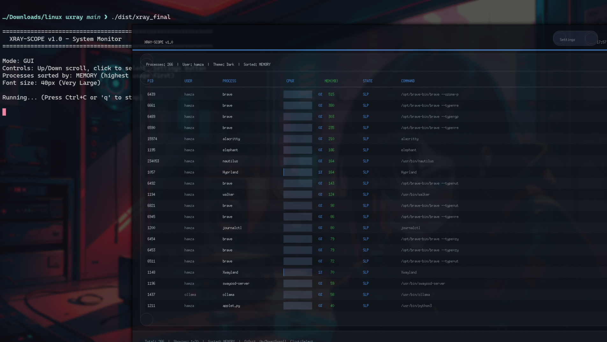
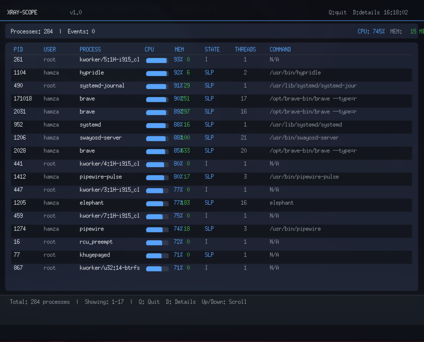

<br>

#  XRAY-SCOPE v1.0 - Real-Time System Monitor

**XRAY-SCOPE** is a powerful, real-time system monitoring tool for Linux with a beautiful resizeable GUI featuring a large, easy-to-read interface.

---

##  Screenshots

<p align="center">
  
  <br>
  <b>XRAY-SCOPE Main Interface</b> - Real-time process monitoring with dark theme
</p>


<br>

<p align="center">
  
  <br>
  <b>Detailed Process View</b> - CPU, memory, state, threads, and command line
</p>


---

##  Features

| Feature                     | Description                                            |
| --------------------------- | ------------------------------------------------------ |
| **Resizeable Window**       | Drag to resize, table adapts automatically             |
| **Live Process Monitoring** | Real-time updates of all system processes              |
| **Large Font (40px)**       | Easy to read from a distance                           |
| **Memory-based Sorting**    | Processes sorted by highest memory usage               |
| **Color-coded Memory**      | Green (<1GB), Orange (1-5GB), Red (>5GB)               |
| **CPU Progress Bars**       | Visual bars showing CPU usage per process              |
| **Color-coded States**      | RUN=Green, SLP=Blue, ZMB=Orange, STP=Red               |
| **Process Details**         | PID, User, Name, CPU%, Memory, State, Threads, Command |
| **Click to Select**         | Click any row to select and highlight a process        |
| **Settings Panel**          | Toggle Sleep Mode and Dark/Light Theme                 |
| **Scrollbar**               | Easy navigation through process list                   |
| **Keyboard Controls**       | Up/Down scroll, Q to quit                              |
| **Low Memory Usage**        | ~50MB RAM footprint                                    |

---

##  Requirements

### Build Dependencies

**Ubuntu/Debian:**

```bash
sudo apt-get update
sudo apt-get install -y build-essential gcc make pkg-config \
    libx11-dev libxcb-dev libxrandr-dev libxinerama-dev \
    libxcursor-dev libxi-dev
```

Fedora/RHEL:

```bash
sudo dnf install -y gcc make pkgconfig \
    libX11-devel libXcb-devel libXrandr-devel \
    libXinerama-devel libXcursor-devel libXi-devel

```

Arch Linux:

```bash
sudo pacman -S gcc make pkg-config \
    libx11 libxcb libxrandr libxinerama \
    libxcursor libxi
Runtime Requirements
Linux kernel 2.6+ (any distribution)
```


**X11 server (for GUI mode)**


Quick Installation
One-Command Build & Run (Easiest)

```bash
git clone https://github.com/hamzaabde-langjk/btop-xray.git && \
cd btop-xray && \
chmod +x scripts/build.sh && \
./scripts/build.sh && \
./dist/xray_final
Step-by-Step Build
bash
```


# 1. Clone the repository

git clone https://github.com/hamzaabde-langjk/btop-xray.git
cd btop-xray

# 2. Build the project

```bash
chmod +x scripts/build.sh
./scripts/build.sh
```

# 3. Run the application

```bash 
./dist/xray_final
```


Manual Build (Advanced)

### If you prefer to build manually:

# Build Shared Memory

```bash
gcc -O2 -c src/shared/shm.c -o shm.o -I.
```

# Build Ring Buffer

```bash
gcc -O2 -c src/shared/ring_buffer.c -o ring.o -I.
```

# Build Renderer

```bash
gcc -O2 -c src/gfx/renderer.c -o renderer.o -I.
```

# Build GUI Interface

```bash
gcc -O2 -c src/ui/interface.c -o interface.o -I. -Isrc/ui -Isrc/shared -I/usr/include/X11 -lm
```

# Build Polling Engine

```bash
gcc -O2 -fPIC -shared -o polling.so src/engine/polling.c -lm -lpthread -I.
```

# Build Main Program

```bash 
gcc -O2 -c src/main.c -o main.o -I. -Isrc/engine -Isrc/shared -Isrc/ui -Isrc/gfx
```

# Link Everything

```bash
gcc -O2 -o xray main.o shm.o ring.o renderer.o interface.o -lm -lpthread -ldl -lX11
```

# Create Distribution

```
mkdir -p dist
cp xray dist/xray_final
chmod +x dist/xray_final
cp polling.so dist/
```

**🏗️ Project Structure**

```text
btop-xray/
├── README.md              # This file
├── scripts/
│   └── build.sh           # Build script
├── src/
│   ├── main.c             # Main entry point
│   ├── engine/
│   │   ├── adapter.h      # Engine interface
│   │   └── polling.c      # Polling monitoring engine
│   ├── gfx/
│   │   ├── renderer.h     # Renderer interface
│   │   └── renderer.c     # X11 renderer
│   ├── ui/
│   │   ├── interface.h    # GUI interface
│   │   └── interface.c    # GUI implementation
│   └── shared/
│       ├── shm.h          # Shared memory interface
│       ├── shm.c          # Shared memory implementation
│       ├── ring_buffer.h  # Ring buffer interface
│       └── ring_buffer.c  # Ring buffer implementation
└── dist/                  # Output directory
    ├── xray_final         # Final executable
    └── polling.so         # Polling engine library
🎮 How to Use
Basic Usage
bash
```


# Run with GUI (default)

./dist/xray_final

# Run in headless mode (terminal only)

```text
./dist/xray_final --headless
Keyboard Shortcuts
Key	Action
q or ESC	Quit the application
↑ (Up Arrow)	Scroll up through process list
↓ (Down Arrow)	Scroll down through process list
Click on row	Select a process (highlighted in blue)
Settings Panel (Click the "Settings" button)
Setting	Description
Sleep Mode	Toggle ON/OFF - Slower updates to save CPU
Theme	Switch between Dark and Light mode
What You See
The GUI displays:

Header Bar - Application name, version, current time, Settings button

Stats Bar - Total processes, User, Theme, Sorting method

Process Table:

PID: Process ID

USER: Owner of the process

PROCESS: Process name

CPU%: CPU usage with visual progress bar

MEM(MB): Memory usage in MB (color-coded)

STATE: Process state (color-coded)

THREADS: Number of threads

COMMAND: Full command line (truncated)

Scrollbar - For navigating long process lists

Footer - Total processes, visible range, keyboard shortcuts
```


## Process States Color Guide

```python
State	Color	    Meaning
#RUN	🟢 Green	Process is currently running
#SLP	🔵 Blue	    Process is sleeping/interruptible
#DSK	🟣 Purple	Process is in disk sleep
#ZMB	🟠 Orange	Process is zombie/defunct
#STP	🔴 Red	    Process is stopped/traced
```


## Memory Usage Color Guide

```python
Memory	  Color
#< 1GB	  🟢 Green
#1-5GB	  🟠 Orange
#> 5GB	  🔴 Red
```


> ## Troubleshooting
>
> Error: shmget: Invalid argument
> bash

# Remove old shared memory segments

```bash
ipcrm -M 0x58415259 2>/dev/null || true
```

# Rebuild and run

```bash
rm -rf dist *.o *.so xray
./scripts/build.sh
./dist/xray_final
```

