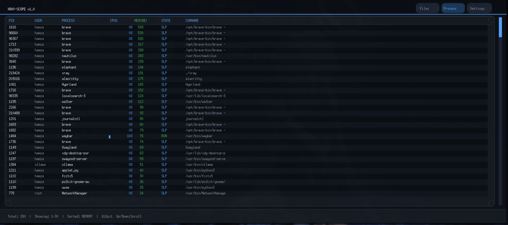
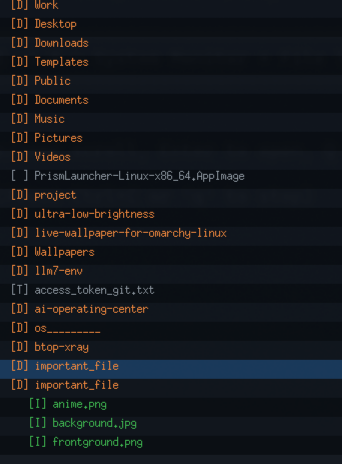
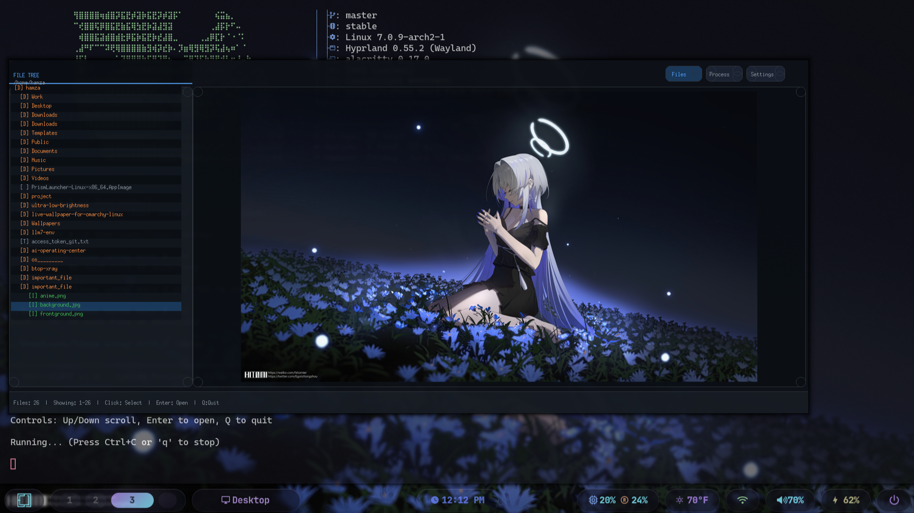

<p align="center">
  
  
  
  
  
  
</p>

<p align="center">
  
</p>

---

##  able of Contents

- [Overview](#-overview)
- [Features](#-features)
- [Screenshots](#-screenshots)
- [Requirements](#-requirements)
- [Installation](#-installation)
- [Usage](#-usage)
- [Keyboard Shortcuts](#-keyboard-shortcuts)
- [Supported File Types](#-supported-file-types)
- [Settings Panel](#-settings-panel)
- [Architecture](#-architecture)
- [Troubleshooting](#-troubleshooting)
- [License](#-license)

---

##  Overview

**XRAY-SCOPE** is a powerful, real-time Linux system monitoring tool combined with a full-featured file explorer. Built entirely in **C with X11**, it provides a beautiful, responsive GUI with:

-  **Real-time process monitoring** (CPU, Memory, State)
-  **Interactive file tree** with expand/collapse
-  **Image preview** inside the GUI (using Imlib2)
-  **Video playback** embedded in the GUI (using mpv)
-  **Code preview** with line numbers for 60+ file types
-  **Dark/Light themes** with smooth transitions
-  **Double buffering** for flicker-free rendering

All in a **single-file implementation** (~2500 lines of pure C).

---

##  Features

###  Process Monitor

| Feature            | Description                                     |
| ------------------ | ----------------------------------------------- |
| Live Monitoring    | Real-time updates of all system processes       |
| Memory Sorting     | Processes sorted by highest memory usage        |
| CPU Progress Bars  | Visual bars showing CPU usage per process       |
| Color-coded Memory | 🟢 Green (<1GB), 🟠 Orange (1-5GB), 🔴 Red (>5GB)  |
| Color-coded States | 🟢 RUN, 🔵 SLP, 🟠 ZMB, 🔴 STP                      |
| Process Details    | PID, User, Name, CPU%, Memory, State, Command   |
| Click to Select    | Click any row to select and highlight a process |
| Low Memory Usage   | ~50MB RAM footprint                             |

###  File Explorer

| Feature            | Description                                           |
| ------------------ | ----------------------------------------------------- |
| Tree View          | Hierarchical file tree with expand/collapse           |
| Visual Indentation | `└─` style indentation for tree depth                 |
| File Type Icons    | `[D]` Directory, `[I]` Image, `[V]` Video, `[T]` Text |
| Color-coded Files  | Different colors for folders, images, videos, text    |
| Interactive Scroll | Mouse wheel + keyboard scrolling                      |
| Click Selection    | Click any file to preview                             |

###  Media Preview

| Feature          | Description                                 |
| ---------------- | ------------------------------------------- |
| Image Preview    | Display images inside GUI using Imlib2      |
| Video Playback   | Embed mpv player inside preview area        |
| Code Preview     | Show source code with line numbers          |
| Auto-Open Option | Toggle auto-open videos on selection        |
| Cache System     | Images cached to prevent flickering         |
| Aspect Ratio     | Images scaled while preserving aspect ratio |

###  User Interface

| Feature           | Description                       |
| ----------------- | --------------------------------- |
| Double Buffering  | Flicker-free rendering            |
| Rounded Corners   | Modern UI with rounded rectangles |
| Dark/Light Themes | Toggle between themes             |
| Resizeable Window | Adapts to window size changes     |
| Settings Panel    | 4 configurable options            |
| Scrollbar         | Visual scrollbar for long lists   |

---

##  Screenshots

<p align="center">
  
  <br>
  <b>Process Monitor</b> - Real-time process monitoring with dark theme
</p>


<p align="center">
  
  <br>
  <b>File Tree</b> - Interactive file explorer with code preview
</p>


<p align="center">
  
  <br>
  <b>Media Preview</b> - Image and video preview inside GUI
</p>
---

##  Demo Video
[https://github.com/user-attachments/assets/d195b810-b73d-4fbd-9e82-e76a9a9a6cc9](https://github.com/user-attachments/assets/d195b810-b73d-4fbd-9e82-e76a9a9a6cc9)


<p align="center">
  <a href="[https://github.com/user-attachments/assets/d195b810-b73d-4fbd-9e82-e76a9a9a6cc9](https://github.com/user-attachments/assets/d195b810-b73d-4fbd-9e82-e76a9a9a6cc9)">
    <input type="button" alt="XRAY-SCOPE Demo Video" width="85%">
  </a>
  <br>
  <b> Watch Demo</b> - Full walkthrough of XRAY-SCOPE features
</p>


> <b>Tip:</b> Click the thumbnail above to watch the full demo video, or download `xray-demo.mp4` from the repository's assets.


---


##  Requirements

### Build Dependencies

**Ubuntu/Debian:**

```bash
sudo apt-get update
sudo apt-get install -y build-essential gcc \\
    libx11-dev libimlib2-dev
```

**Fedora:**

```bash
sudo dnf install -y gcc make \\
    libX11-devel imlib2-devel
```

**Arch Linux:**

```bash
sudo pacman -S gcc libx11 imlib2
```

### Install mpv for video support

```bash
sudo apt-get install mpv        # Ubuntu/Debian
sudo dnf install mpv            # Fedora
sudo pacman -S mpv              # Arch
```

### Runtime Requirements

| Requirement       | Description                   |
| ----------------- | ----------------------------- |
| Linux kernel 2.6+ | Any distribution              |
| X11 server        | For GUI mode                  |
| mpv               | For video playback (optional) |

---

##  Installation

### Quick Build (Recommended)

```bash
# Single command build
gcc -O2 -o xray main.c -lm -lpthread -ldl -lX11 -lImlib2

# Run the application
./xray
```

### Build Script

```bash
# Create build script
cat > build.sh << 'EOF'
#!/bin/bash
echo "Building XRAY-SCOPE v1.0..."
gcc -O2 -o xray main.c -lm -lpthread -ldl -lX11 -lImlib2
if [ $? -eq 0 ]; then
    echo " Build successful!"
    echo "Run with: ./xray"
else
    echo " Build failed!"
    exit 1
fi
EOF

chmod +x build.sh
./build.sh
```

### Create Distribution

```bash
mkdir -p dist
cp xray dist/xray_final
chmod +x dist/xray_final
./dist/xray_final
```

### Clone and Build

```bash
git clone https://github.com/hamzaabde-langjk/btop-xray.git && \\
cd btop-xray && \\
gcc -O2 -o xray main.c -lm -lpthread -ldl -lX11 -lImlib2 && \\
./xray
```

---

##  Usage

```bash
# Run with GUI (default)
./xray

# Run in headless mode (terminal only)
./xray --headless
```

### Navigation

**Process Monitor** (default view):

- See all running processes
- Sorted by memory usage (highest first)
- Click any process to select it

**File Explorer:**

- Click "Files" button to switch
- Navigate the file tree
- Click files to preview
- Press Enter to open video

**Settings:**

- Click "Settings" button
- Toggle options:
  - **Sleep Mode:** Reduce CPU usage
  - **Theme:** Dark/Light mode
  - **Preview:** Enable/disable preview panel
  - **Auto Video:** Auto-play videos on selection

---

##  Keyboard Shortcuts

| Key              | Action                           |
| ---------------- | -------------------------------- |
| `q` or `ESC`     | Quit the application             |
| `↑` (Up Arrow)   | Scroll up / Select previous file |
| `↓` (Down Arrow) | Scroll down / Select next file   |
| `Enter`          | Open directory / Play video      |
| Mouse Wheel      | Scroll through lists             |
| Click            | Select item                      |

---

##  Supported File Types

### Text Files (60+ Extensions)

| Category    | Extensions                                                 |
| ----------- | ---------------------------------------------------------- |
| C/C++       | `.c`, `.h`, `.cpp`, `.cc`, `.cxx`, `.hpp`, `.hxx`, `.hh`   |
| Java/Kotlin | `.java`, `.kt`, `.kts`, `.scala`, `.groovy`, `.gradle`     |
| Python/Ruby | `.py`, `.pyw`, `.pyx`, `.rb`, `.erb`, `.pl`, `.pm`         |
| JavaScript  | `.js`, `.jsx`, `.ts`, `.tsx`, `.mjs`, `.cjs`               |
| Web         | `.html`, `.htm`, `.css`, `.scss`, `.sass`, `.less`         |
| Data        | `.json`, `.xml`, `.yaml`, `.yml`, `.toml`, `.ini`, `.conf` |
| Shell       | `.sh`, `.bash`, `.zsh`, `.fish`, `.bat`, `.cmd`, `.ps1`    |
| Docs        | `.md`, `.markdown`, `.txt`, `.rst`, `.adoc`, `.tex`        |
| Go/Rust     | `.go`, `.rs`, `.swift`, `.dart`                            |
| C#/F#       | `.cs`, `.fs`, `.fsx`, `.vb`                                |
| PHP         | `.php`, `.phtml`                                           |
| Other       | `.sql`, `.lua`, `.r`, `.hs`, `.ex`, `.erl`, `.asm`         |

### Special Files

- `Makefile`, `Dockerfile`, `Jenkinsfile`, `Vagrantfile`
- `Gemfile`, `Rakefile`, `CMakeLists.txt`
- `.gitignore`, `.env`, `.bashrc`, `.zshrc`, `.profile`
- `LICENSE`, `README`, `CHANGELOG`

### Image Files

`.png`, `.jpg`, `.jpeg`, `.gif`, `.bmp`, `.svg`, `.webp`, `.ico`, `.tiff`, `.tif`

### Video Files

`.mp4`, `.avi`, `.mkv`, `.mov`, `.wmv`, `.flv`, `.webm`, `.m4v`, `.mpg`, `.mpeg`, `.3gp`, `.ogv`

---

##  Settings Panel

Access via the "Settings" button in the top-right corner:

| Setting    | Default | Description                          |
| ---------- | ------- | ------------------------------------ |
| Sleep Mode | OFF     | Reduces update frequency to save CPU |
| Theme      | Dark    | Toggle between Dark and Light themes |
| Preview    | ON      | Show/hide the preview panel          |
| Auto Video | OFF     | Auto-play videos when selected       |

---

##  Architecture

### Project Structure

```
btop-xray/
├── main.c              # Single-file implementation (~2500 lines)
├── README.md           # This file
├── build.sh            # Build script (optional)
├── xray-screenshot.png # Screenshot
├── xray-file-tree.png  # File tree screenshot
├── xray-media.png      # Media preview screenshot
└── dist/
    └── xray_final      # Final executable
```

### Technical Details

| Component       | Technology                   |
| --------------- | ---------------------------- |
| Language        | C (C11 standard)             |
| GUI Framework   | X11 (Xlib)                   |
| Image Rendering | Imlib2                       |
| Video Playback  | mpv (embedded via `--wid`)   |
| Threading       | POSIX threads (pthreads)     |
| Rendering       | Double buffering with Pixmap |
| Process Data    | `/proc` filesystem parsing   |

### Key Implementation Details

- **Double Buffering:** All drawing happens on a Pixmap (back buffer), then copied to window in one operation to prevent flickering.
- **Image Caching:** Images are loaded once and cached in memory. Only reloaded when the file changes.
- **Video Embedding:** Uses `mpv --wid=WINDOW_ID` to embed the video player inside a child X11 window.
- **Process Monitoring:** Reads from `/proc/[pid]/stat`, `/proc/[pid]/statm`, `/proc/[pid]/status` for real-time data.
- **X11 Threading:** Uses `XInitThreads()` for safe multithreading with X11.

---

##  Process States Color Guide

| State | Color    | Meaning                           |
| ----- | -------- | --------------------------------- |
| RUN   | 🟢 Green  | Process is currently running      |
| SLP   | 🔵 Blue   | Process is sleeping/interruptible |
| DSK   | 🟣 Purple | Process is in disk sleep          |
| ZMB   | 🟠 Orange | Process is zombie/defunct         |
| STP   | 🔴 Red    | Process is stopped/traced         |

---

##  Memory Usage Color Guide

| Memory | Color    |
| ------ | -------- |
| < 1GB  | 🟢 Green  |
| 1-5GB  | 🟠 Orange |
| > 5GB  | 🔴 Red    |

---

##  Troubleshooting

### Build Errors

**Error: `Imlib2.h: No such file or directory`**

```bash
# Install Imlib2 development files
sudo apt-get install libimlib2-dev
```

**Error: `cannot find -lX11`**

```bash
# Install X11 development files
sudo apt-get install libx11-dev
```

**Error: `Cannot open display`**

```bash
# Make sure X11 server is running
echo $DISPLAY
# Should show something like :0 or :1
```

**Error: `mpv: command not found`**

```bash
# Install mpv for video support
sudo apt-get install mpv
```

**Error: `shmget: Invalid argument`**

```bash
# Remove old shared memory segments
ipcrm -M 0x58415259 2>/dev/null || true

# Rebuild and run
rm -rf dist *.o *.so xray
gcc -O2 -o xray main.c -lm -lpthread -ldl -lX11 -lImlib2
./xray
```

### Video plays outside the GUI

```bash
# Make sure mpv supports --wid option
mpv --version
# Should be version 0.30+
```

### Flickering images

- Double buffering is enabled by default
- If you still see flickering, check your X11 compositor settings

### Performance Issues

**High CPU usage**

- Enable Sleep Mode in Settings to reduce update frequency
- Close unnecessary processes

**Slow file tree loading**

- The file tree loads the entire `$HOME` directory
- For large directories, this may take a few seconds

---

##  Contributing

Contributions are welcome! Here's how you can help:

- **Report bugs** - Open an issue with detailed description
- **Suggest features** - Share your ideas
- **Submit PRs** - Fork, modify, and submit pull requests
- **Improve docs** - Help with documentation

### Development Setup

```bash
# Clone the repository
git clone https://github.com/hamzaabde-langjk/btop-xray.git
cd btop-xray

# Install dependencies
sudo apt-get install libx11-dev libimlib2-dev mpv

# Build
gcc -O2 -o xray main.c -lm -lpthread -ldl -lX11 -lImlib2

# Run
./xray
```

---

##  Acknowledgments

- **X11** - For the windowing system
- **Imlib2** - For image rendering
- **mpv** - For video playback
- **Linux /proc filesystem** - For process information

---

##  Contact

- **GitHub:** [@hamzaabde-langjk](https://github.com/hamzaabde-langjk)
- **Repository:** [btop-xray](https://github.com/hamzaabde-langjk/btop-xray)

---

<p align="center">
  <b>Made with ❤️ using C and X11</b>
  <br>
  <sub>XRAY-SCOPE v1.0 - See your system clearly</sub>
</p>

